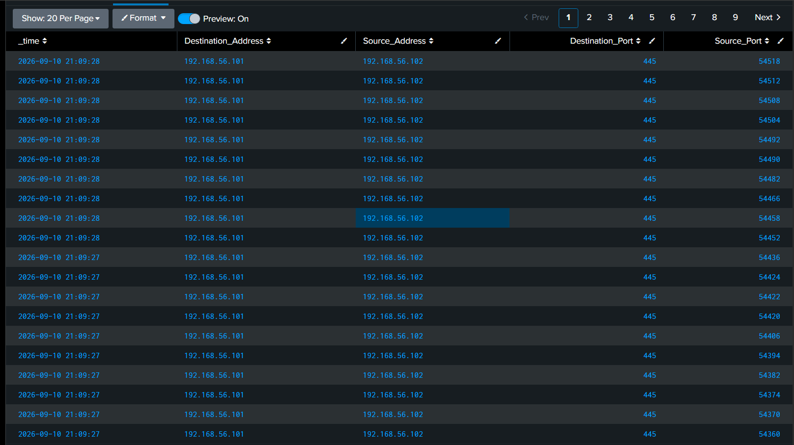

# Detecting an SMB Port Scan via Windows Security Auditing + Splunk

## Objective
Detect reconnaissance activity (port scanning) against a Windows host 
using native Windows security auditing forwarded to Splunk.

## Environment
- Kali Linux (attacker) — 192.168.56.102
- Windows 10 (target) — 192.168.56.101
- Isolated VirtualBox Host-only network
- Splunk Universal Forwarder → Splunk Enterprise (indexer)
- Windows "Filtering Platform Connection" auditing enabled via `auditpol`

## Attack Performed
​```
nmap -p 445 192.168.56.101
​```

## Detection
Windows Security EventCode 5156, captured in Splunk:
​```
index=* sourcetype="WinEventLog:Security" EventCode=5156 Direction=Inbound
​```



## Analysis
Dozens of inbound connection events from a single source IP hit the 
target's port 445 within roughly one second, each using a distinct, 
sequential ephemeral source port. This pattern — high frequency, single 
source/destination pair, sequential ports — is a strong indicator of 
automated scanning rather than normal traffic.

## Would-Be Response
- Flag source IP for continued monitoring
- Check for follow-up exploitation attempts against the same host
- Correlate with firewall/IDS logs for broader scan coverage
