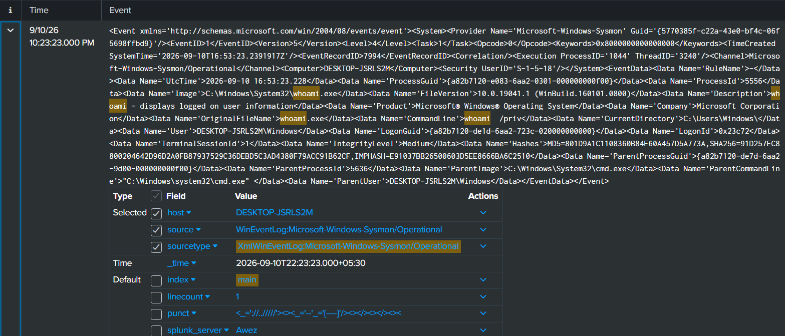

Objective: Demonstrate detection and analysis of a process-creation event using Sysmon logs forwarded to Splunk, focusing on parent-child process relationships — a core technique for spotting suspicious activity.

Environment: Windows 10 VM with Sysmon (SwiftOnSecurity config) and Splunk Universal Forwarder, logs indexed in Splunk Enterprise.

Action performed: Ran whoami /priv from a Command Prompt window to simulate a post-compromise privilege enumeration command — a common step an attacker takes after gaining initial access, to check what privileges their current session has.

Detection: Sysmon Event ID 1 (Process Creation), captured via:
```
index=* sourcetypr=*sysmon* "whoami"
```


Key fields observed:

 •	Image: C:\Windows\System32\whoami.exe
 
 •	CommandLine: whoami /priv 
 
 •	ParentImage: C:\Windows\system32\cmd.exe
 
 •	User: DESKTOP-JSRLS2M\Windows
 
 •	IntegrityLevel: Medium

Analysis: The event shows whoami.exe spawned as a child process of cmd.exe — a normal, expected relationship for a command run interactively. In a real investigation, an analyst would evaluate this in context: whoami /priv alone is benign and commonly run by legitimate users and admins, but becomes suspicious when seen shortly after an unusual ParentImage (e.g. a spawned from a web browser, Office document, or unfamiliar script), when the IntegrityLevel is unexpectedly High/System, or when followed by further enumeration commands (net user, systeminfo, net group) — a pattern associated with post-exploitation reconnaissance.

Would-be response: On its own, this event doesn't warrant action. An analyst would correlate it with the parent process's origin (how was cmd.exe itself launched?) and look for a broader chain of suspicious activity before escalating.
